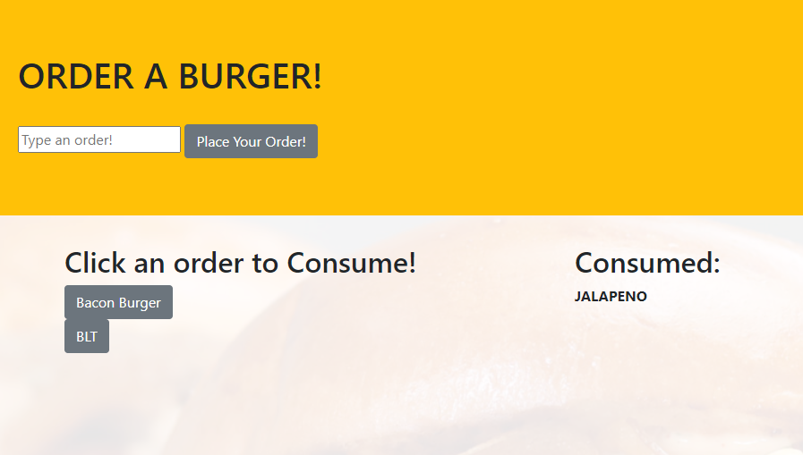

# ORDER AND CONSUME A BURGER
## u13-burger-app

### Description

This application is a simple burger order/eat app.

You type in the name of a burger, and place your order!

It will then show up under the "click an order to consume" column.
You may click on a burger to consume it, and move it to the consumed column.

### Img of Heroku Deployment

### Links

[Deployed Application](https://u13-burger-app.herokuapp.com/)

[GitHub Repo](https://github.com/epowelldev/u13-burger-app)